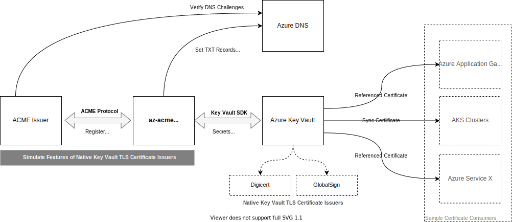

# AZ ACMI 

ACMI compliant certificate management CLI tool that has been designed to be highly opinionated and focused on managing the lifecycle of TLS certificates within the Microsoft Azure ecosystem. 

While there are many ACMI clients that exist, ```az-acme``` is different in that it has been designed to align with the following principals.

- Replicate certificate management capabilities for ACMI based certificate issues that exist natively between Azure Key Vault and Digicert / GlobalSign.
- Store certificates in Azure Key Vault to enable existing Azure integrations between services and Key Vault to operate as expected, and aligned with existing Azure best practices.
- Separate TLS certificate management processes from Azure compute resources. This means only ACME DNS challenges are supported.

The following outlines the context of ```az-acme``` within the wider context. To certificate consumers, there is no difference between using a certificate managed by a native integration (Digicert / GlobalSign) and those obtained from an ACMI provider(s).



## Register with Provider

Registering supports both standard and External Account Binding (EAB). 

The following shows a registration with the Lets Encrypt Staging server.

```bash
./az-acme register \
	   --key-vault-uri https://<key vault name>.vault.azure.net/ \
	   --server https://acme-v02.api.letsencrypt.org/directory \
       --account-secret reg-stg-lets-encrypt \
       --email <your-email-address> \
       --agree-tos \
       --verbose
```

For services that use EAB, such as ZeroSSL, additional parameters can be provided.

```bash
./az-acme register \
        --key-vault-uri https://<key vault name>.vault.azure.net/ \
        --server https://acme.zerossl.com/v2/DV90 \
        --account-secret reg-stg-lets-encrypt \
        --email <your-email-address> \
        --eab-kid <key id from provider> \
        --eab-hmac-key <key from provider> \
        --eab-algo <key from provider> \
        --agree-tos \
        --verbose
```


## Ordering Certificate

Ordering a certificate is based on a s

```bash
./az-acme order --verbose \
        --key-vault-uri https://<key vault name>.vault.azure.net/ \
        --certificate cert-le-stg-101 \
        --server https://acme-v02.api.letsencrypt.org/directory \
        --subject stgle01.azacme.dev \
        --sans stgle002.azacme.dev stgle003.azacme.dev \
        --account-secret reg-le-stg-azacme-dev \
        --azure-dns-zone /subscriptions/<subscription-id>/resourceGroups/<resource-group>/providers/Microsoft.Network/dnszones/azacme.dev \
        --force-order
```

The output of the above will result in output similar to the below.


When executing without the ```--force-order``` switch the order is only submitted to the ACME provider if the certificate does not exist within Azure Key Vault, or will expire within the specified number of days (see ```--renew-within``` parameter, defaults to 30 days) from the time of executution.


